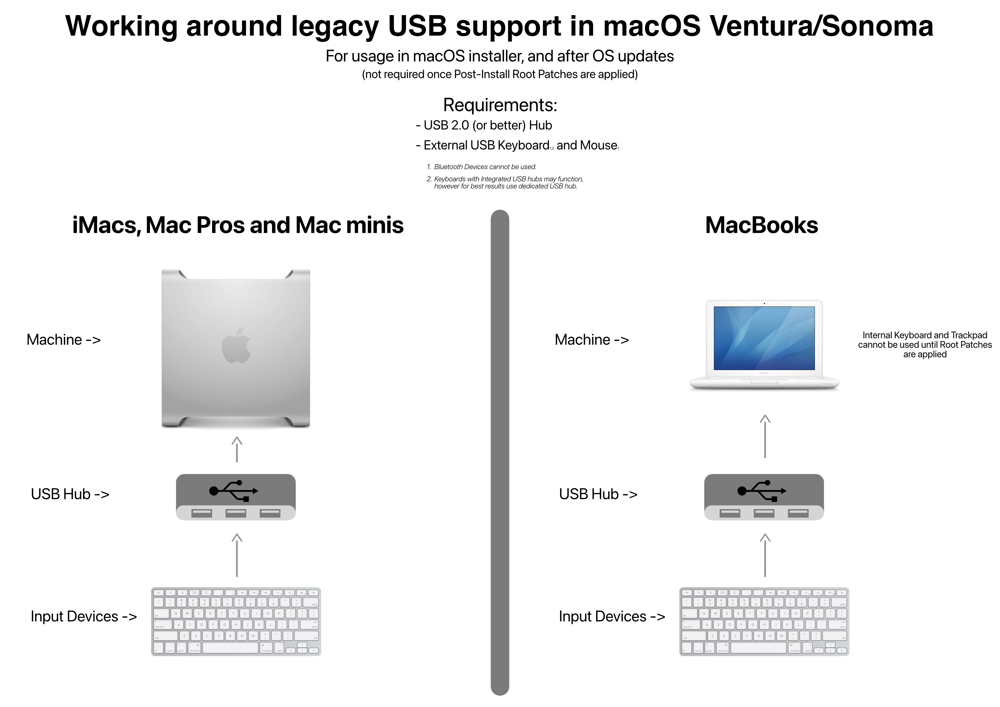

Another year, another release.

This time Apple dropped surprisingly few amount of Macs. With the release of OpenCore Legacy Patcher 2.0.0, early support for macOS Sequoia has been implemented.


## Newly dropped hardware

* MacBookAir8,1 :       MacBook Air (2018)
* MacBookAir8,2 :       MacBook Air (2019)

## Current status

OpenCore Legacy Patcher 2.0.0 will support Sequoia for most models normally supported by the Patcher, however some challenges remain. You can find information about them below.

Unfortunately due to T2 related problems, the recently dropped MacBookAir8,x models cannot be supported at this time.

[More information here](https://github.com/dortania/OpenCore-Legacy-Patcher/issues/1136)

## Non-functional features

iPhone Mirroring and Apple Intelligence won't be functional on majority of patched Macs. 

iPhone Mirroring requires T2 for attestation and Apple Intelligence requires an NPU only found in Apple Silicon, the patcher is unable to provide a fix for these as they're hardware requirements.

## Issues

* [Dual socket CPUs with Mac Pros and Xserve](#dual-socket-cpus-with-mac-pro-2008-and-xserve-2008)
* [T2 Security chip](#t2-security-chip)
* [USB 1.1 (OHCI/UHCI) Support](#usb-11-ohciuhci-support)
* [Graphics support and issues](#graphics-support-and-issues)


### Dual socket CPUs with Mac Pro 2008 and Xserve 2008

Booting Sequoia on Mac Pro 2008 (MacPro3,1) or Xserve 2008 (Xserve2,1) with more than 4 cores will cause Sequoia to panic. OpenCore Legacy Patcher will automatically disable additional cores.

This is due to the dual socket nature of the machine, and likely some firmware/ACPI table incompatibility. 

**If building OpenCore for older OS, this limitation can be disabled in Settings -> Build -> "MacPro3,1/Xserve2,1 Workaround".** 

::: warning Note

Dual booting Sequoia and older will not be possible with all cores enabled due to reasons described before. In these cases you will be limited to 4 cores.

:::

### T2 security chip

The current biggest issue we face with supporting the MacBookAir8,x (2018/19) series is the T2 chip's lack of communication when booted through OpenCorePkg.

What happens when one of these units boots through OpenCorePkg is that AppleKeyStore.kext panics due to timeouts with the T2 chip:

```
"AppleKeyStore":3212:0: sks timeout strike 18
"AppleKeyStore":3212:0: sks timeout strike 19
"AppleKeyStore":3212:0: sks timeout strike 20
panic(cpu 0 caller 0xffffff801cd12509): "AppleSEPManager panic for "AppleKeyStore": sks request timeout" @AppleSEPManagerIntel.cpp:809
```

This affects not only macOS Sequoia, but macOS Ventura and Sonoma are confirmed to have the same issue. Thus an underlying problem with the MacBookAir8,x's firmware where it is not happy with OpenCorePkg.

We currently do not have any leads on what exactly breaks the T2.
* MacBookPro15,2, MacBookPro16,2 and Macmini8,1 do not exhibit these issues in local testing
* MacPro7,1 does seem to surprisingly based on reports: [MacPro7,1 - OpenCorePkg](https://forums.macrumors.com/threads/manually-configured-opencore-on-the-mac-pro.2207814/post-29418464)
  * Notes from this report were unsuccessful locally: [Cannot boot MacPro7,1 #1487](https://github.com/acidanthera/bugtracker/issues/1487)


### USB 1.1 (OHCI/UHCI) Support

For Penryn systems, pre-2013 Mac Pros and Xserve, USB 1.1 support was outright removed in macOS Ventura, therefore this applies all the way to Sequoia.
While USB 1.1 may seem unimportant, it handles many important devices on your system. These include:

* Keyboard and Trackpad for laptops
* IR Receivers
* Bluetooth

Users will need to use a USB hub for installation and post-OS updates when patches are cleaned:

However, the driver has recently been weakened starting from Sonoma, which means even some USB hubs may not work properly. 

An alternative way is making sure to enable "Remote Login" in General -> Sharing before updating, which will enable SSH. 
That means you can take control using Terminal in another system by typing `ssh username@lan-ip-address` and your password. 

After that run Post Install Volume Patching by typing `/Applications/OpenCore-Patcher.app/Contents/MacOS/OpenCore-Patcher --patch-sys-vol` and finally `sudo reboot`.




::: warning The following systems rely on USB 1.1

* iMac10,x and older
* Macmini4,1 and older
* MacBook7,1 and older
* MacBookAir3,1 and older
* MacPro5,1 and older
* Xserve 3,1 and older
:::

[More information here](https://github.com/dortania/OpenCore-Legacy-Patcher/issues/1021)

### Graphics support and issues
This build includes both Legacy Metal and non-Metal patches for macOS Sequoia. Refer to the following links for more information about Legacy Metal and non-Metal support and their respective issues.

* [Legacy Metal](https://github.com/dortania/OpenCore-Legacy-Patcher/issues/1008)
* [Non-Metal](https://github.com/dortania/OpenCore-Legacy-Patcher/issues/108)
